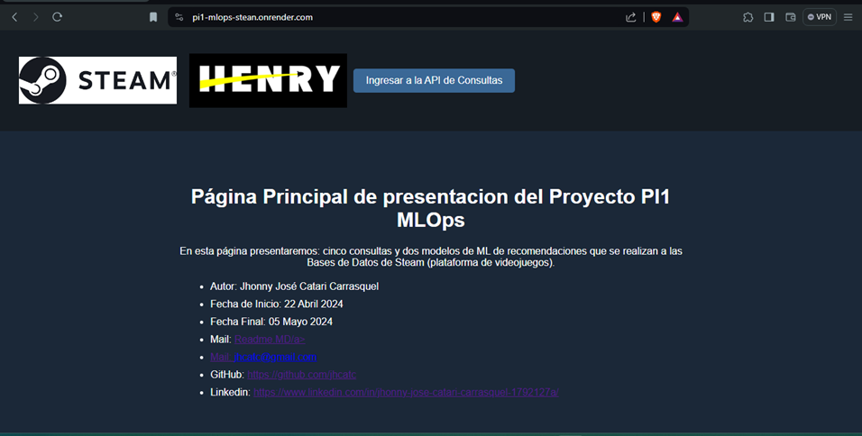
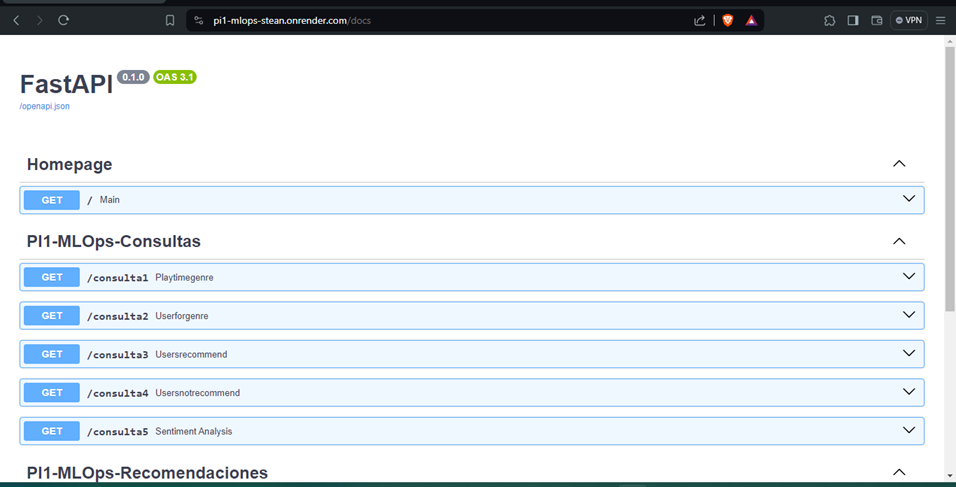

|  ||   |

# PI1 - MLOps

    Como parte demostrativa de la cursada de Data Science de Henry, estan los Labs. En este Proyecto nos enfocamos en el primer Proyecto individual, este proyecto consta de un MVP (_Minimum Viable Product_) donde existe parametros mínimos esperados, se asume un ROL de Data Science paar el alumno.
____________________

## Proyecto de ML y Consultas Datos de la plataforma Steam

    Se nos ha suministrado tres Bases de Datos en formato json comprimidas gz, luego de realizar ETL yEDA, nos quedamos con 3 Dataframes de Formato .parquet comprimidos, los cuales estan en este mismo repositorio

#### Los Dataframe son:
.- df_items:
Compuesto por: item_id (id del videojuego), playtime_2weeks (tiempo de juego en minutos del jugador en 2 semanas), playtime_forever (tiempo de juego en minutos del jugador en todo el tiempo), item_name (nombre del videojuego), user_id (id del jugador).

No existen datos nulos, ni datos Outoutliers en el Dataframe en Datos de importancia.

A este Dataframe se le realiza un sample random con una semilla de reproducibilidad, despues de esto nos quedamos con un 10% del Dataframe original tratado completamente. Motivado e la limitante de espacio y memoria dsiponible en la franja gratuita de Render y limitantes tambien en GitHub.

.- df_games:
Compuesto por: genres (Generos de los juegos, esta columna ha sido tratada y normalizada), id_game (id del videojuego), year_release (año de lanzamiento del videojuego), app_name (nombre del videojuego).

No existen datos nulos, ni datos Outoutliers en el Dataframe en Datos de importancia.

.- df_reviews:
Compuesto por: item_id (id del videojuego), recommend (indica si el videojuego es recomendado o no lo es), date (año en que se realizo el review por parte del jugador), user_id (id del jugador), sentiment_analysis (analisis sentimental en estala de 0, 1 y 2).

No existen datos nulos, ni datos Outoutliers en el Dataframe en Datos de importancia.

A una columna original llamada review, se hace Normalizado y Lematizado. A este texto se realiza Analisis Sentimental con librerias de NLTK, aplicando valores de: 0 para reviews negativos, 1 para reviews neutrales y 2 para reviews positivos.

#### Las Consultas solicitadas son:
.- def PlayTimeGenre(genre:str):
    Debe devolver año con mas horas jugadas para un genero consultado por el usuario de la API.

.- def UserForGenre(genre:str):
    Debe devolver el usuario que acumula más horas jugadas para el género consultado por el usuario de la API y una lista de la acumulación de horas jugadas por año.

.- def UsersRecommend(year:int):
   Devuelve el top 3 de juegos MÁS recomendados por usuarios para el año consultado por el usuario de la API. (reviews.recommend = True y comentarios positivos/neutrales)

.- def UsersNotRecommend(year:int):
   Devuelve el top 3 de juegos MENOS recomendados por usuarios para el año consultado por el usuario de la API. (reviews.recommend = False y comentarios negativos)

.- def sentiment_analysis(year:int):
    Según el año consultado por el usuario de la API, se devuelve una lista con la cantidad de registros de reseñas de usuarios que se encuentren categorizados con un análisis de sentimiento. 

#### Recomendaciones solicitadas son:
Modelos de recomendacion con el uso de la Similitud del Coseno.

.- def recomendacion_juego(id de producto):
    Ingresando el id de producto por parte del usuario de la API, deberíamos recibir una lista con 5 juegos recomendados similares al ingresado. Sistema de recomendacion item-item.

.- def recomendacion_usuario(id de usuario):
    Ingresando el id de un usuario por parte del usuario de la API, deberíamos recibir una lista con 5 juegos recomendados para dicho usuario. Sistema de recomendacion user-item.
____________________________

## Presentacion de la API

    Ya completado los ETL y EDA, se realizan los funciones para consultas y recomendaciones con el uso de las librerias necesarias en un main.py. Se coloca el respectivo requirements.txt con lo requerido, .gitignore para ignorar todo lo que no se quiere subir a GitHub, asi como la carpeta Lib/ y la carpeta Scripts/.

    El repositorio finalizado y probado en local con el uso de FastAPI y Uvicorn. Se sube a GitHub, junto a un Dockerfile en el cual se crea un entorno virtual, en este se instalan todas las dependencias y se deja abierto para oir el puerto 8000. Asi mismo al pie del main.py se deja la entrada de la aplicacion dejando dispobible el puerto 8000

    if __name__ == '__main__':
    uvicorn.run(app, host="0.0.0.0", port=8000)

    Se realiza Deploy a un servidor con el uso de Render y ayuda del Dockerfile antes comentado.
_______________________________

________________________________
